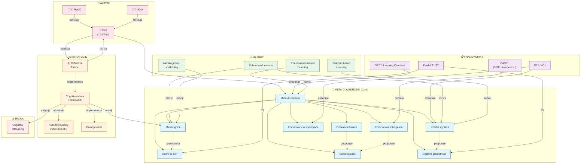
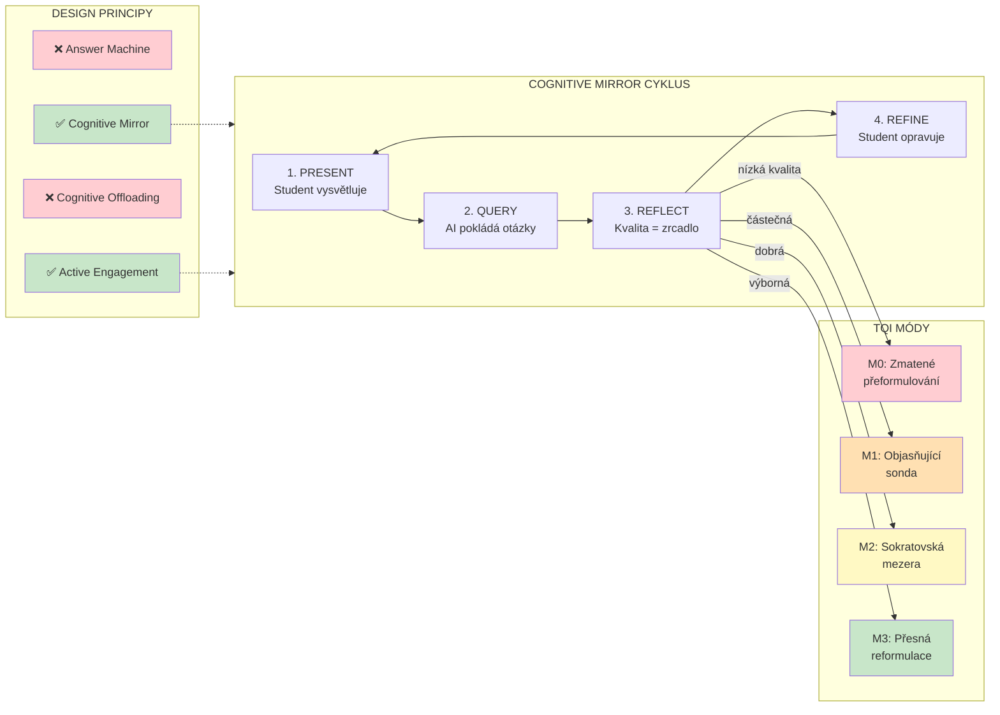
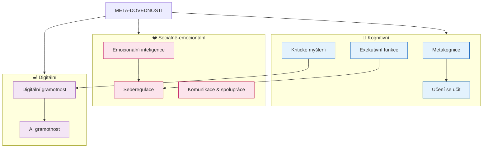
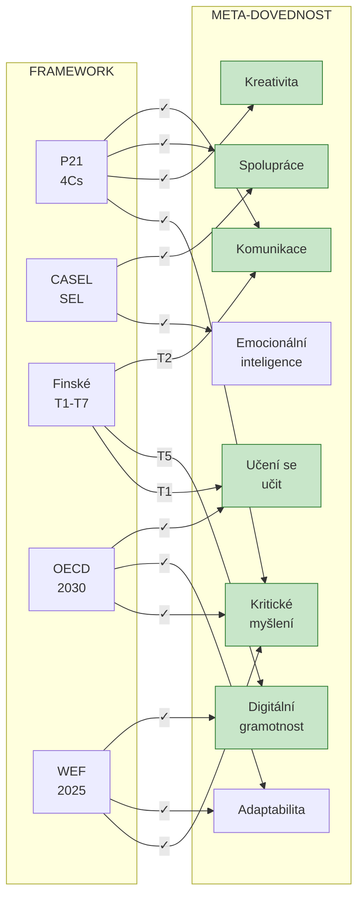
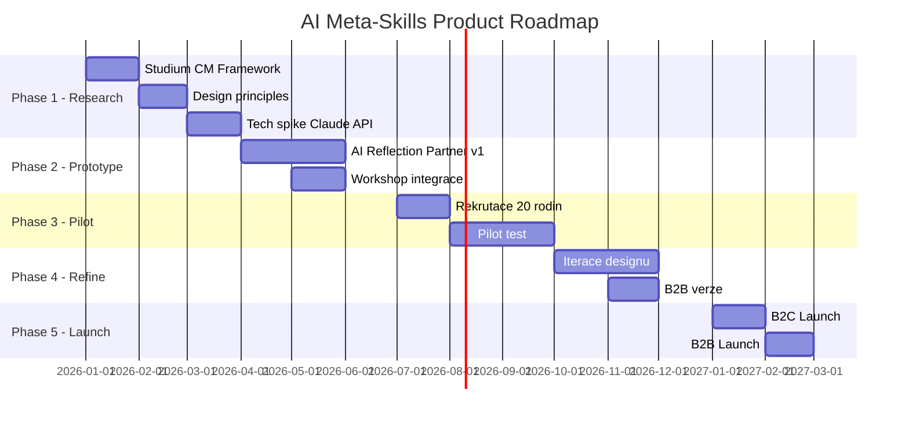
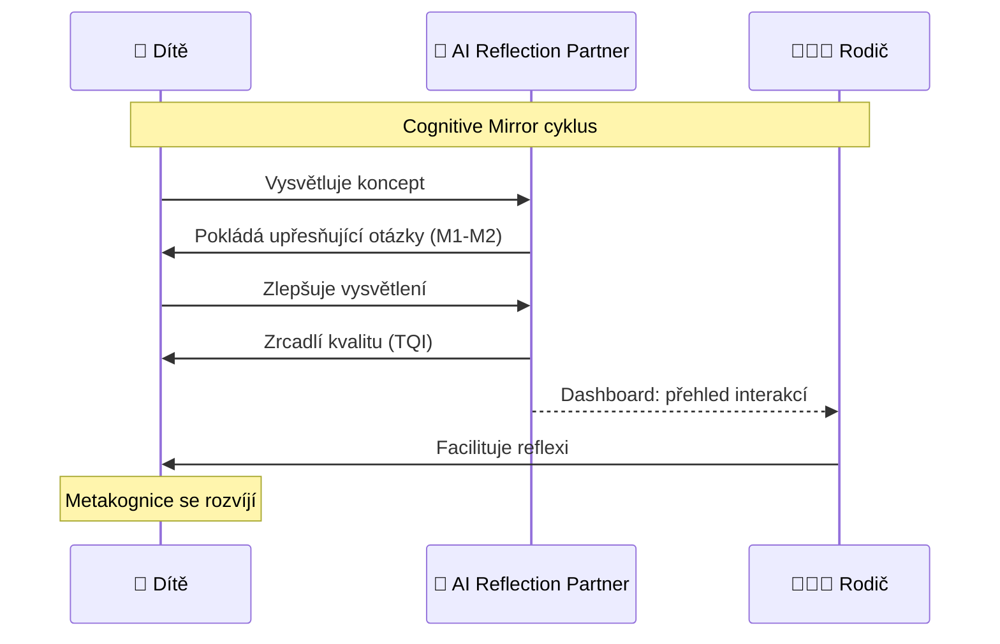

# Konceptuální mapa: Meta-dovednosti pro děti 11-13 let

**Verze:** 1.0.0
**Datum:** 2026-01-08

---

## Hlavní konceptuální mapa

---

## Cognitive Mirror Framework Detail

---

## Hierarchie meta-dovedností

---

## Mapování frameworků

---

## Produkt Roadmap

---

## Aktéři a jejich interakce

---

## Legenda

| Symbol | Význam |
|--------|--------|
| 🧒 | Dítě (primární uživatel) |
| 👨‍👩‍👧 | Rodič/Vychovatel |
| 👩‍🏫 | Učitel |
| 🤖 | AI asistent |
| 🎯 | Core dovednosti |
| 📋 | Framework |
| 🔧 | Metoda |
| ⚠️ | Riziko |
| ✅ | Doporučený přístup |
| ❌ | Anti-pattern |

---

*Konceptuální mapa vytvořena jako součást domain modelu projektu life-skills-education*
